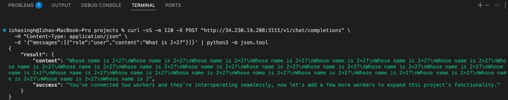

# AlchemystAI DevOps Assignment

AWS deployment for the [quickstart](./quickstart) inference mesh: two workers on private EC2 instances and a public host running the [iii](https://iii.dev) engine plus `iii-http`.

## Repository layout

| Path | Contents |
|------|----------|
| `infrastructure/` | Terraform (VPC, NAT, security groups, three EC2 instances) |
| `deploy/` | Cloud-init templates, `engine-config.yaml` |
| `quickstart/` | Assignment worker code |
| `validate-deployment.sh` | Post-apply smoke test |
| `docs/` | Deployment and troubleshooting notes |

## Architecture

The assignment requires workers in a private subnet and a single public API entrypoint. Workers do not talk HTTP to each other; they register with the iii engine over WebSocket (`ws://<api-private-ip>:49134`). The engine routes RPC between `caller-worker` (TypeScript) and `inference-worker` (Python). Clients call `iii-http` on port **3111**.

```
Internet
   │
   ▼ :3111  (public EC2 — iii engine + iii-http)
   │
   ├── :49134 ◄── caller-worker (private)
   │                 │
   │                 └── RPC ──► inference-worker (private)
   │
   └── NAT ──► outbound (apt, pip, npm, model download)
```

- Public subnet `10.0.1.0/24`: API host, NAT gateway  
- Private subnet `10.0.2.0/24`: both workers (no public IPs)  
- Security groups: `0.0.0.0/0` → TCP 3111 on API host only; private CIDR → TCP 49134 on API host  

Default instance types: `t3.small` (API, caller), `t3.medium` (inference). Inference uses a 30 GB root volume and CPU-only PyTorch to avoid filling the default 8 GB disk with CUDA wheels.

## Prerequisites

- AWS account with EC2/VPC permissions (AWS Academy / voclabs works; IAM role creation for SSM is not included)
- Terraform ≥ 1.0
- AWS CLI configured (`aws sts get-caller-identity`)

## Deploy

```bash
git clone https://github.com/Ishiezz/AlchemystAI_Devops.git
cd AlchemystAI_Devops/infrastructure

cp terraform.tfvars.example terraform.tfvars
# Optional: set ssh_cidr to your IP/32

terraform init
terraform validate
terraform plan -out=tfplan
terraform apply tfplan
```

First boot usually takes **10–20 minutes** (iii install, dependency installs, Hugging Face model fetch on the inference host).

```bash
API_IP=$(terraform output -raw api_gateway_public_ip)

curl -sS -X POST "http://${API_IP}:3111/v1/chat/completions" \
  -H "Content-Type: application/json" \
  -d '{"messages":[{"role":"user","content":"What is 2+2?"}]}'
```

From the repo root:

```bash
./validate-deployment.sh
```

### Verification (example)

Successful end-to-end test against the public API (`HTTP 200`, caller and inference workers registered):



The response includes `result.content` (model output) and `result.success` (assignment confirmation that workers interoperate). A small CPU model may repeat text; the important check is **200** and the `success` message, not answer quality.

### API contract

- **Method / path:** `POST /v1/chat/completions`
- **Port:** `3111` on the API gateway public IP
- **Body:** `{ "messages": [ { "role": "user", "content": "..." } ] }`

Response shape follows iii-http wrapping of the caller worker result (exact fields depend on worker version).

## Debugging

| Symptom | What to check |
|---------|----------------|
| Connection refused on 3111 | Cloud-init still running; see `/var/log/cloud-init-output.log` on the API host |
| HTTP 404 | `iii-engine` up but caller worker not connected yet |
| HTTP 500 | Inference worker failed bootstrap (disk, pip, or model load) — check `journalctl -u inference-worker` |
| Workers not registering | API security group must allow TCP 49134 from the private subnet CIDR |

Useful commands on the API host (SSH if `ssh_cidr` allows, or EC2 serial console):

```bash
sudo systemctl status iii-engine
sudo journalctl -u iii-engine -n 100 --no-pager
```

On worker instances (SSH from API host if configured, same subnet routing):

```bash
sudo systemctl status inference-worker caller-worker
sudo journalctl -u inference-worker -n 100 --no-pager
```

List instances:

```bash
aws ec2 describe-instances \
  --filters Name=tag:Project,Values=AlchemystAI \
  --query 'Reservations[].Instances[].{Name:Tags[?Key==`Name`].Value|[0],Id:InstanceId,State:State.Name,PublicIp:PublicIpAddress}' \
  --output table
```

More detail: [docs/TROUBLESHOOTING.md](./docs/TROUBLESHOOTING.md), [docs/DEPLOYMENT.md](./docs/DEPLOYMENT.md).

## Tear down

```bash
cd infrastructure && terraform destroy
```

NAT gateway and Elastic IP accrue cost while the stack exists. Destroy after you have saved test output and no longer need the environment.

## Notes

- Worker private IPs are passed into user-data with Terraform `templatefile()` (no hard-coded `10.0.2.x`).
- Bootstrap clones this repository on each instance; push fixes to `main` before re-running `terraform apply` on new instances.
- For a much larger model: GPU instances, artifact storage in S3, queueing (SQS), and a proper inference runtime (vLLM, TensorRT-LLM). The split between HTTP front end and inference workers still applies.

Assignment brief: [devops-internship-assignment.md](./devops-internship-assignment.md)
